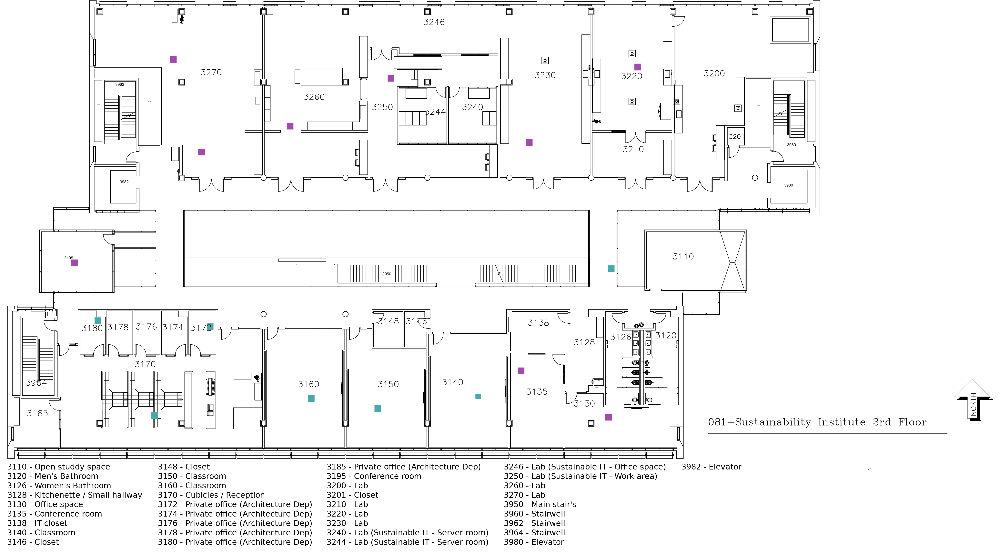
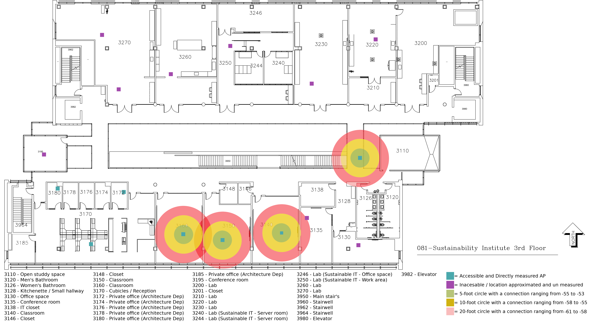

# 
**Third Floor   of the   Sustainability Institute**

## 
By Julian Mato-Hernandez, Joshua Kelly, Ryan Schanzenbacher, Will Gorczyca

---

### **Exec Summary:**

#### This wireless site survey was performed on the third floor of the Sustainability Institute by a group of the following individuals: Julian Mato-Hernandez, Will Gorczyca, Josh Kelly, and Ryan Schanzenbacher. The reason for performing this survey was to strengthen our knowledge on the multiple metrics that are used to measure the strength of wireless signals. Our survey takes into account the various factors that affect wireless coverage and assist each surveyor in understanding the modern approaches towards wireless technologies at the production sites.

#### This report shows certain details regarding the third floor of the Sustainability Institute, including

<ul>
  <li>Information on the access points</li>
  <li>The floor plan</li>
  <li>Signal strength</li>
  <li>Limitations</li>
  <li>Survey Findings</li>
</ul>

#### In this wireless site survey, our goals are to discover the capabilities of the infrastructure and network at the Sustainability Institute and assess the coverage of each wireless access point. The factors involved in measuring the coverage involve the number of wireless APs, where each device is located, and the range of coverage.

---

### **Table of Contents:**

- [Executive Summary](#exec-summary)
- [Table of Contents](#table-of-contents)
- [Introduction](#introduction)
- [Floor Study](#floor-study)
- [AP Study](#ap-study)
- [Performance Study](#performance-study)
- [Site Personal Survey](#site-personal-survey)
- [Assessment](#assessment)
- [Recommendations](#recommendations)
- [Appendix](#appendix)
  - [Appendix A](#appendix-a)
  - [Appendix B](#appendix-b)
  - [Appendix C](#appendix-c)
  - [Appendix D](#appendix-d)
  - [Appendix E](#appendix-e)
  - [Appendix F](#appendix-f)
- [Footer](#footer)

---

### **Introduction:**

#### Team four has chosen to conduct a site survey of the 3rd floor of Sustainability Institute. This site survey will include an evaluation of the floor layout, investigation into where the access points are located on the floor, and an analysis of the performance of the APs on the floor. Lastly, we will be reviewing the data to determine where and how improvements could be made to the wireless network infrastructure on the floor. We will be accumulating this information into a presentation given to the class, as well as this report

#### As for the technology used much of our data was collected on [Kismet](https://www.kismetwireless.net/) a WiFi, RF, and Bluetooth monitoring software with some analytics and data parsing though limited by being inherently under funded and under staffed as most FOSS (Free and Open Source Software) project we chose it due to its flexibility, Kismet uses a clever custom file storage solution by embedding all the data collected by the software in to a .kismet file, this file is a lightly modified .netxml DB in a file, it even utilizes a journal file that is written along side the main .kismet DB. The kismet team has gone so far to make it so that the file is dynamically mounted by an sqlite3 server so that the file can be truly random access. The use of a DB file system is that extracting data in specific orders such as a csv, xml, pcap, or even gps and ADSB data is very fast and there is a little to no chance of large files having faults or corruption that could interfere with packet analyses software

#### Most if not all of the software we used followed in the same vane as Kismet in the sense that they are flexible, extendable, extensible, abd most importantly Free and Open Source, such as [Iperf3](https://iperf.fr/), Iperf3 was our primary way of testing access points network performance, good put, through put, and average data rate among other minor metrics. Most of the time we used Iperf3 we had an other software close at hand, [Wireshark](https://www.wireshark.org/) this is an invaluable tool in not only the data collection portion, which Wireshark is the underlying software kismet uses to sniff packets, but during the data parsing having the ability to have a light and responsive way to see the raw data makes double checking the higher level softwares work and help you understand the results. Speaking of hire level software to make parsing data less of a chore we used [Scappy](https://scapy.net/) to pull large chunks of easier to read data. For the last networking related software we used was a little know one called [EtherApe](https://etherape.sourceforge.io/) while not the most precise or integral of our software suite it did give impressively very good insight on how the devices in the building where talking to each other I would go as far as to say its the most understandably intuitive depiction of wifi networking i have seen to date, but above all it brought transitions and there sizes in to perspective and made outliers we had missed blatantly obvious. there is a short example in [Appendix F](#appendix-f) though i don't know if it will be there in a PDF

---

### **Floor Study:**

#### Our study was conducted on the third floor of Sustainability Institute (Bldg. 81). This floor has eighteen rooms (excluding restrooms and closets). These rooms are used for office, class, meeting, and laboratory/research space. Due to access limitations, we were unable to see if devices inside the lab space caused interference to the access point (AP) signal. There were at least sixteen AP on the floor, mostly limited to within rooms. Only one AP was located in the hallway, and multiple AP were within feet of each other located in very small office spaces. We believe the close proximity of these APs could cause interference

---

### **AP Study:**

#### Placement: During our site survey we evaluated the effectiveness of the placement of the APs on the floor. We found that most APs were placed in classrooms, separated from the main hallways by glass. These APs were about 6 feet from the walls, meaning the glass had a good chance of isolating the signals from the AP to just be within the room. The hallway contains 1 AP located on the east side of the building, which services the public areas of the floor

#### Interference: We found quite a few points of interference during the study. The biggest dead zone we observed was between room 3140 and the hallway AP. When standing near room 3138, the signal strength observed was about -92dB. We believe this was because the contents of room 3140 to be a networking closet, containing tons of equipment very likely to interfere with the signal coming from the APs. Outside of the networking closet, we found more sources of interference within the 2.4GHz band from 4 separate APs. On channels 1,5, 6, and 12, we have APs from two unknown manufacturers, one Texas Instruments device, one Lantronix device and a Hewlett-Packard device. Most of the rogue APs were broadcasting random lookin SSIDs, while the Hewlett-Packard device was broadcasting an SSID named “rit”. This leads us to believe that this device was most likely a printer that used to be associated with the RIT network that was shut down in May, sending out probe requests to find the network again. The rest of the devices are most likely lab equipment from the various labs we were not able to get into during our study

---

### **Performance Study:**

#### We were able to get data for the following wireless access points: room 3140, 3150, 3160, and the walkway under the stairs. The following metrics were measured during the multiple Perf tests: transfer (in Megabytes), bitrate (in Megabits per second), jitter (in seconds), and the percentage of data lost out of the total amount of data (a percentage). We made a difference in measurements between the transmitter and receiver antennas of each wireless access point

#### For the room 3140 transmitter, we were able to measure an average transfer of 142.6 MB per test. The bitrate measured out to be an average of 108.82 Mbps. This room’s receiver measured an average transfer and bitrate of 141.7 MB and 113.53 Mbps, respectively. The percentage of data lost ended up averaging out to 0% for both the transmitter and receiver, with a total of 0 bits being lost. In this room, there was no jitter measured

#### Right next door to room 3140 is the classroom known as room 3150. For the room’s transmitter, the average transfer measured was 157.8 MB. This comes with a bitrate of 131.8 Mbps. Along with this, there is a jitter of 0.556 seconds. The receiver for the same wireless access point measured an average transfer of 133.4 MB. Bitrates, compared to the transmitter, are less with a value of 106.35 Mbps. The jitter was greater than the transmitter with a value of 0.752 seconds. Both the transmitter and receiver measured an average of 0 bits being lost, leading to an average data loss of 0%

#### In the last classroom, room 3160, had weaker measurements compared to the other classrooms. The transfer on the transmitter and receiver averaged out to 127.9 MB and 127.1 MB, respectively. A measurement of 105.58 Mbps was measured for the transmitter, while the receiver had a bitrate of 105.43 Mbps. The transmitter’s jitter measured at 1.284 seconds (the greatest jitter measurement) as the receiver’s jitter reached 0.621 seconds. An average data loss of 0 bits was measured, giving us a 0%

#### At the walkway under the staircase, the transmitter measured an average transfer for 131.1 MB. The bitrate measured at 108.67 Mbps, while there was a jitter of 0925 seconds. For this wireless access point’s receiver, the transfer averaged to 130.4 MB. The receiver, also, gave a bitrate of 109.70 Mbps and a jitter of 1.045 seconds. The average data loss was 0%, with 0 bits lost for both the receiver and transmitter

---

### **Site Personal Survey:**

#### We conducted a personal survey[^questions] which asked three open ended questions and one multiple choice question in order to gauge Wi-Fi user activity habits and satisfaction. Between our six respondents, the most common Wi-Fi activity reported included: surfing the internet, using email, Zoom meetings, taking notes, and transferring files. Around 66% of respondents said that they were more than satisfied with their Wi-Fi connection, and around 33% said that they were satisfied with their Wi-Fi connection. When asked about connection interruptions, very few respondents reported their connection dropping on a regular basis. Lastly, the data collected indicates that the wireless network on the floor is mainly utilized between 8 AM to 5 PM Monday through Friday

---

### **Assessment:**

#### Overall, we found the wifi on the third floor to be adequate, especially if you are in a classroom. If you are in the study area on the floor, you will still have a decent signal, as the AP located in the public section of the floor is located just off-center of the study area. The worst areas of reception will be the west side of the floor, as there are no APs located in the public areas of the hallway, meaning most of your reception will be from either APs blocked by the walls of different rooms or from different floors; most likely the fourth floor as these specific APs signals are biased downwards, so it would be less likely to connect to the second floor APs over the fourth floor

---

### **Recommendations:**

#### Our recommendations cover three areas of improvement: AP density, AP location, and AP quantity. In the case of the small offices located in room 3170, we recommend spacing those AP farther apart in order to improve signal quality and reduce interference due to AP density. Due to our studies showing better signal performance from a farther distance to the AP, we believe that improvements to AP density and AP placement would occur by moving classroom AP closer to the doors, and moving office AP into the larger common areas. In regards to AP quantity, we believe adding additional AP to the hallway areas would improve Wi-Fi signal, even if the other APs remain where they are

---

## **Appendix:**

---

### **Appendix A:**

#### **AP Heat Map**

\_\_

---

### **Appendix B:**

#### **AP Heat Map with Key**

\_\_

---

### **Appendix C:**

#### **Public Survey given out at Sustainability**

\_\_

[^questions]:

---

### **Appendix D:**

#### **Rogue Access Points**

\_\_

|  #  |       BSSID       | Channel |         SSID         |  Percent Packets   |   Percent Retry   | Retry | Beacons | Data Pkts | Probe Reqs | Probe Resp | Auths | Deauths | Other | Protection |
| :-: | :---------------: | :-----: | :------------------: | :----------------: | :---------------: | :---: | :-----: | :-------: | :--------: | :--------: | :---: | :-----: | :---: | :--------: |
|  0  | 00:80:a3:df:08:90 |    5    | 2rlqlmiwIh7ClPocUpi0 | 0.3822467615204927 | 22.22222222222222 |   4   |   13    |     0     |     0      |     5      |   0   |    0    |   0   |            |
|  1  | 02:29:e9:f6:59:f6 |    6    |   HPCP1525-99a763    | 1.3803355277128901 |         0         |   0   |   52    |     0     |     0      |     13     |   0   |    0    |   0   |            |
|  2  | 02:80:a3:8b:34:42 |    5    | qe23ubrOP3lclxuBRUkl | 0.2335952431514122 | 36.36363636363637 |   4   |    6    |     0     |     0      |     5      |   0   |    0    |   0   |            |

---

### **Appendix E:**

#### **RIT Wireless Networks Details**

\_\_

|  #  |       BSSID       | Channel |     SSID      |   Percent Packets    | Percent Retry | Retry | Beacons | Data Pkts | Probe Reqs | Probe Resp | Auths | Deauths | Other | Protection |
| :-: | :---------------: | :-----: | :-----------: | :------------------: | :-----------: | :---: | :-----: | :-------: | :--------: | :--------: | :---: | :-----: | :---: | :--------: |
|  0  | 34:fc:b9:12:a0:90 |   161   |   RIT-WiFi    |  0.3822467615204927  |       0       |   0   |   17    |     0     |     0      |     0      |   0   |    0    |   1   |            |
|  1  | 34:fc:b9:12:a0:92 |   161   |    eduroam    | 0.36101083032490977  |       0       |   0   |   17    |     0     |     0      |     0      |   0   |    0    |   0   |            |
|  2  | 34:fc:b9:12:a0:93 |   161   |   RIT-Guest   | 0.36101083032490977  |       0       |   0   |   17    |     0     |     0      |     0      |   0   |    0    |   0   |            |
|  3  | 34:fc:b9:12:a8:10 |   36    |   RIT-WiFi    |  0.7644935230409854  |       0       |   0   |   36    |     0     |     0      |     0      |   0   |    0    |   0   |            |
|  4  | 34:fc:b9:12:a8:12 |   36    |    eduroam    |  0.8282013166277341  |       0       |   0   |   39    |     0     |     0      |     0      |   0   |    0    |   0   |            |
|  5  | 34:fc:b9:12:a8:13 |   36    |   RIT-Guest   |  0.7857294542365683  |       0       |   0   |   37    |     0     |     0      |     0      |   0   |    0    |   0   |            |
|  6  | 34:fc:b9:12:fb:d0 |   100   |   RIT-WiFi    | 0.21235931195582927  |       0       |   0   |   10    |     0     |     0      |     0      |   0   |    0    |   0   |            |
|  7  | 34:fc:b9:12:fb:d2 |   100   |    eduroam    | 0.19112338076024635  |       0       |   0   |    9    |     0     |     0      |     0      |   0   |    0    |   0   |            |
|  8  | 34:fc:b9:12:fb:d3 |   100   |   RIT-Guest   | 0.21235931195582927  |       0       |   0   |   10    |     0     |     0      |     0      |   0   |    0    |   0   |            |
|  9  | 34:fc:b9:12:fc:10 |   56    |   RIT-WiFi    | 0.042471862391165856 |       0       |   0   |    2    |     0     |     0      |     0      |   0   |    0    |   0   |            |
| 10  | 34:fc:b9:12:fc:12 |   56    |    eduroam    | 0.021235931195582928 |       0       |   0   |    1    |     0     |     0      |     0      |   0   |    0    |   0   |            |
| 11  | 34:fc:b9:12:ff:f0 |   161   |   RIT-WiFi    |  0.5308982798895732  |       0       |   0   |   24    |     0     |     0      |     0      |   0   |    0    |   1   |            |
| 12  | 34:fc:b9:12:ff:f2 |   161   |    eduroam    |  0.5096623486939902  |       0       |   0   |   24    |     0     |     0      |     0      |   0   |    0    |   0   |            |
| 13  | 34:fc:b9:12:ff:f3 |   161   |   RIT-Guest   |  0.5308982798895732  |       0       |   0   |   25    |     0     |     0      |     0      |   0   |    0    |   0   |            |
| 14  | 34:fc:b9:13:01:b0 |   52    |   RIT-WiFi    | 0.06370779358674877  |       0       |   0   |    3    |     0     |     0      |     0      |   0   |    0    |   0   |            |
| 15  | 34:fc:b9:13:01:b2 |   52    |    eduroam    | 0.10617965597791464  |       0       |   0   |    5    |     0     |     0      |     0      |   0   |    0    |   0   |            |
| 16  | 34:fc:b9:13:01:b3 |   52    |   RIT-Guest   | 0.12741558717349755  |       0       |   0   |    6    |     0     |     0      |     0      |   0   |    0    |   0   |            |
| 17  | 34:fc:b9:13:01:d0 |   40    |   RIT-WiFi    |  0.573370142280739   |       0       |   0   |   27    |     0     |     0      |     0      |   0   |    0    |   0   |            |
| 18  | 34:fc:b9:13:01:d2 |   40    |    eduroam    |  0.6583138670630707  |       0       |   0   |   31    |     0     |     0      |     0      |   0   |    0    |   0   |            |
| 19  | 34:fc:b9:13:01:d3 |   40    |   RIT-Guest   |  0.6583138670630707  |       0       |   0   |   31    |     0     |     0      |     0      |   0   |    0    |   0   |            |
| 20  | 34:fc:b9:13:02:f0 |   56    |   RIT-WiFi    |  0.5308982798895732  |       0       |   0   |   25    |     0     |     0      |     0      |   0   |    0    |   0   |            |
| 21  | 34:fc:b9:13:02:f2 |   56    |    eduroam    |  0.4884264174984073  |       0       |   0   |   23    |     0     |     0      |     0      |   0   |    0    |   0   |            |
| 22  | 34:fc:b9:13:02:f3 |   56    |   RIT-Guest   |  0.5096623486939902  |       0       |   0   |   24    |     0     |     0      |     0      |   0   |    0    |   0   |            |
| 23  | 34:fc:b9:13:03:50 |   116   |   RIT-WiFi    |  0.4671904863028244  |       0       |   0   |   22    |     0     |     0      |     0      |   0   |    0    |   0   |            |
| 24  | 34:fc:b9:13:03:52 |   116   |    eduroam    |  0.4671904863028244  |       0       |   0   |   22    |     0     |     0      |     0      |   0   |    0    |   0   |            |
| 25  | 34:fc:b9:13:03:53 |   116   |   RIT-Guest   |  0.4671904863028244  |       0       |   0   |   22    |     0     |     0      |     0      |   0   |    0    |   0   |            |
| 26  | 34:fc:b9:13:03:e0 |    6    |   RIT-WiFi    | 0.021235931195582928 |       0       |   0   |    1    |     0     |     0      |     0      |   0   |    0    |   0   |            |
| 27  | 34:fc:b9:13:03:e2 |    6    |    eduroam    | 0.042471862391165856 |       0       |   0   |    2    |     0     |     0      |     0      |   0   |    0    |   0   |            |
| 28  | 34:fc:b9:13:03:e3 |    6    |   RIT-Guest   | 0.042471862391165856 |       0       |   0   |    2    |     0     |     0      |     0      |   0   |    0    |   0   |            |
| 29  | 34:fc:b9:13:03:f0 |   124   |   RIT-WiFi    |  0.8919091102144829  |       0       |   0   |   41    |     0     |     0      |     1      |   0   |    0    |   0   |            |
| 30  | 34:fc:b9:13:03:f2 |   124   |    eduroam    |  0.8494372478233171  |       0       |   0   |   39    |     0     |     0      |     1      |   0   |    0    |   0   |            |
| 31  | 34:fc:b9:13:03:f3 |   124   |   RIT-Guest   |  0.9131450414100658  |       0       |   0   |   41    |     0     |     0      |     2      |   0   |    0    |   0   |            |
| 32  | 34:fc:b9:13:04:50 |   157   |   RIT-WiFi    |  0.7857294542365683  |       0       |   0   |   35    |     0     |     0      |     0      |   0   |    0    |   2   |            |
| 33  | 34:fc:b9:13:04:52 |   157   |    eduroam    |  0.8069653854321512  |       0       |   0   |   38    |     0     |     0      |     0      |   0   |    0    |   0   |            |
| 34  | 34:fc:b9:13:04:53 |   157   |   RIT-Guest   |  0.7857294542365683  |       0       |   0   |   37    |     0     |     0      |     0      |   0   |    0    |   0   |            |
| 35  | 34:fc:b9:13:04:90 |   36    |   RIT-WiFi    |  0.2548311743469951  |       0       |   0   |   12    |     0     |     0      |     0      |   0   |    0    |   0   |            |
| 36  | 34:fc:b9:13:04:92 |   36    |    eduroam    |  0.276067105542578   |       0       |   0   |   13    |     0     |     0      |     0      |   0   |    0    |   0   |            |
| 37  | 34:fc:b9:13:04:93 |   36    |   RIT-Guest   |  0.2548311743469951  |       0       |   0   |   12    |     0     |     0      |     0      |   0   |    0    |   0   |            |
| 38  | 34:fc:b9:13:07:40 |   11    |   RIT-WiFi    | 0.06370779358674877  |       0       |   0   |    2    |     0     |     0      |     0      |   0   |    0    |   1   |            |
| 39  | 34:fc:b9:13:07:42 |   11    |    eduroam    | 0.042471862391165856 |       0       |   0   |    2    |     0     |     0      |     0      |   0   |    0    |   0   |            |
| 40  | 34:fc:b9:13:07:50 |   161   |   RIT-WiFi    |  0.6583138670630707  |       0       |   0   |   29    |     0     |     0      |     0      |   0   |    0    |   2   |            |
| 41  | 34:fc:b9:13:07:52 |   161   |    eduroam    |  0.552134211085156   |       0       |   0   |   26    |     0     |     0      |     0      |   0   |    0    |   0   |            |
| 42  | 34:fc:b9:13:07:53 |   161   |   RIT-Guest   |  0.552134211085156   |       0       |   0   |   26    |     0     |     0      |     0      |   0   |    0    |   0   |            |
| 43  | 34:fc:b9:13:07:60 |    1    |   RIT-WiFi    | 0.042471862391165856 |       0       |   0   |    2    |     0     |     0      |     0      |   0   |    0    |   0   |            |
| 44  | 34:fc:b9:13:07:62 |    1    |    eduroam    | 0.021235931195582928 |       0       |   0   |    1    |     0     |     0      |     0      |   0   |    0    |   0   |            |
| 45  | 34:fc:b9:13:07:63 |    1    |   RIT-Guest   | 0.021235931195582928 |       0       |   0   |    1    |     0     |     0      |     0      |   0   |    0    |   0   |            |
| 46  | 34:fc:b9:13:07:70 |   100   |   RIT-WiFi    |  0.7857294542365683  |       0       |   0   |   36    |     0     |     0      |     1      |   0   |    0    |   0   |            |
| 47  | 34:fc:b9:13:07:72 |   100   |    eduroam    |  0.7432575918454024  |       0       |   0   |   34    |     0     |     0      |     1      |   0   |    0    |   0   |            |
| 48  | 34:fc:b9:13:07:73 |   100   |   RIT-Guest   |  0.7644935230409854  |       0       |   0   |   35    |     0     |     0      |     1      |   0   |    0    |   0   |            |
| 49  | 34:fc:b9:13:08:70 |   136   |   RIT-WiFi    | 0.021235931195582928 |       0       |   0   |    1    |     0     |     0      |     0      |   0   |    0    |   0   |            |
| 50  | 34:fc:b9:13:08:72 |   136   |    eduroam    | 0.08494372478233171  |       0       |   0   |    3    |     0     |     1      |     0      |   0   |    0    |   0   |            |
| 51  | 34:fc:b9:13:08:73 |   136   |   RIT-Guest   | 0.042471862391165856 |       0       |   0   |    2    |     0     |     0      |     0      |   0   |    0    |   0   |            |
| 52  | 34:fc:b9:13:09:70 |   64    |   RIT-WiFi    |  0.5096623486939902  |       0       |   0   |   24    |     0     |     0      |     0      |   0   |    0    |   0   |            |
| 53  | 34:fc:b9:13:09:72 |   64    |    eduroam    |  0.552134211085156   |       0       |   0   |   26    |     0     |     0      |     0      |   0   |    0    |   0   |            |
| 54  | 34:fc:b9:13:09:73 |   64    |   RIT-Guest   | 0.44595455510724147  |       0       |   0   |   21    |     0     |     0      |     0      |   0   |    0    |   0   |            |
| 55  | 34:fc:b9:13:09:92 |   120   |    eduroam    | 0.021235931195582928 |       0       |   0   |    1    |     0     |     0      |     0      |   0   |    0    |   0   |            |
| 56  | 34:fc:b9:13:09:d0 |   128   |   RIT-WiFi    |  0.4034826927160756  |       0       |   0   |   19    |     0     |     0      |     0      |   0   |    0    |   0   |            |
| 57  | 34:fc:b9:13:09:d2 |   128   |    eduroam    | 0.42471862391165854  |       0       |   0   |   20    |     0     |     0      |     0      |   0   |    0    |   0   |            |
| 58  | 34:fc:b9:13:09:d3 |   128   |   RIT-Guest   | 0.44595455510724147  |       0       |   0   |   21    |     0     |     0      |     0      |   0   |    0    |   0   |            |
| 59  | 34:fc:b9:13:0a:30 |   60    |   RIT-WiFi    |  0.7644935230409854  |       0       |   0   |   36    |     0     |     0      |     0      |   0   |    0    |   0   |            |
| 60  | 34:fc:b9:13:0a:32 |   60    |    eduroam    |  0.7857294542365683  |       0       |   0   |   37    |     0     |     0      |     0      |   0   |    0    |   0   |            |
| 61  | 34:fc:b9:13:0a:33 |   60    |   RIT-Guest   |  0.7644935230409854  |       0       |   0   |   36    |     0     |     0      |     0      |   0   |    0    |   0   |            |
| 62  | 34:fc:b9:13:0b:00 |    1    |   RIT-WiFi    | 0.10617965597791464  |       0       |   0   |    5    |     0     |     0      |     0      |   0   |    0    |   0   |            |
| 63  | 34:fc:b9:13:0b:02 |    1    |    eduroam    | 0.06370779358674877  |       0       |   0   |    3    |     0     |     0      |     0      |   0   |    0    |   0   |            |
| 64  | 34:fc:b9:13:0b:03 |    1    |   RIT-Guest   | 0.08494372478233171  |       0       |   0   |    4    |     0     |     0      |     0      |   0   |    0    |   0   |            |
| 65  | 34:fc:b9:13:0b:10 |   60    |   RIT-WiFi    |  0.8282013166277341  |       0       |   0   |   39    |     0     |     0      |     0      |   0   |    0    |   0   |            |
| 66  | 34:fc:b9:13:0b:12 |   60    |    eduroam    |  0.8494372478233171  |       0       |   0   |   40    |     0     |     0      |     0      |   0   |    0    |   0   |            |
| 67  | 34:fc:b9:13:0b:13 |   60    |   RIT-Guest   |  0.7644935230409854  |       0       |   0   |   36    |     0     |     0      |     0      |   0   |    0    |   0   |            |
| 68  | 34:fc:b9:13:0c:80 |    1    |   RIT-WiFi    | 0.021235931195582928 |       0       |   0   |    1    |     0     |     0      |     0      |   0   |    0    |   0   |            |
| 69  | 34:fc:b9:13:0c:82 |    1    |    eduroam    | 0.021235931195582928 |       0       |   0   |    1    |     0     |     0      |     0      |   0   |    0    |   0   |            |
| 70  | 34:fc:b9:13:0c:83 |    1    |   RIT-Guest   | 0.042471862391165856 |       0       |   0   |    2    |     0     |     0      |     0      |   0   |    0    |   0   |            |
| 71  | 34:fc:b9:13:0c:90 |   44    |   RIT-WiFi    |  0.573370142280739   |       0       |   0   |   25    |     0     |     0      |     0      |   0   |    0    |   2   |            |
| 72  | 34:fc:b9:13:0c:92 |   44    |    eduroam    |  0.552134211085156   |       0       |   0   |   26    |     0     |     0      |     0      |   0   |    0    |   0   |            |
| 73  | 34:fc:b9:13:0c:93 |   44    |   RIT-Guest   |  0.5946060734763219  |       0       |   0   |   28    |     0     |     0      |     0      |   0   |    0    |   0   |            |
| 74  | 34:fc:b9:13:0d:10 |   100   |   RIT-WiFi    |  0.7220216606498195  |       0       |   0   |   34    |     0     |     0      |     0      |   0   |    0    |   0   |            |
| 75  | 34:fc:b9:13:0d:12 |   100   |    eduroam    |  0.6158420046719049  |       0       |   0   |   27    |     0     |     0      |     2      |   0   |    0    |   0   |            |
| 76  | 34:fc:b9:13:0d:13 |   100   |   RIT-Guest   |  0.6583138670630707  |       0       |   0   |   30    |     0     |     0      |     1      |   0   |    0    |   0   |            |
| 77  | 34:fc:b9:13:0d:60 |   11    |   RIT-WiFi    | 0.06370779358674877  |       0       |   0   |    3    |     0     |     0      |     0      |   0   |    0    |   0   |            |
| 78  | 34:fc:b9:13:0d:62 |   11    |    eduroam    | 0.12741558717349755  |       0       |   0   |    4    |     0     |     1      |     1      |   0   |    0    |   0   |            |
| 79  | 34:fc:b9:13:0d:63 |   11    |   RIT-Guest   | 0.06370779358674877  |       0       |   0   |    3    |     0     |     0      |     0      |   0   |    0    |   0   |            |
| 80  | 34:fc:b9:13:0d:70 |   132   |   RIT-WiFi    |  0.8282013166277341  |       0       |   0   |   37    |     0     |     0      |     2      |   0   |    0    |   0   |            |
| 81  | 34:fc:b9:13:0d:72 |   132   |    eduroam    |  0.8494372478233171  |       0       |   0   |   38    |     0     |     0      |     2      |   0   |    0    |   0   |            |
| 82  | 34:fc:b9:13:0d:73 |   132   |   RIT-Guest   |  0.8494372478233171  |       0       |   0   |   37    |     0     |     0      |     3      |   0   |    0    |   0   |            |
| 83  | 34:fc:b9:13:0e:50 |   52    |   RIT-WiFi    |  0.8919091102144829  |       0       |   0   |   42    |     0     |     0      |     0      |   0   |    0    |   0   |            |
| 84  | 34:fc:b9:13:0e:52 |   52    |    eduroam    |  0.8494372478233171  |       0       |   0   |   40    |     0     |     0      |     0      |   0   |    0    |   0   |            |
| 85  | 34:fc:b9:13:0e:53 |   52    |   RIT-Guest   |  0.8919091102144829  |       0       |   0   |   42    |     0     |     0      |     0      |   0   |    0    |   0   |            |
| 86  | 34:fc:b9:13:0f:30 |   116   |   RIT-WiFi    | 0.10617965597791464  |       0       |   0   |    5    |     0     |     0      |     0      |   0   |    0    |   0   |            |
| 87  | 34:fc:b9:13:0f:32 |   116   |    eduroam    | 0.08494372478233171  |       0       |   0   |    4    |     0     |     0      |     0      |   0   |    0    |   0   |            |
| 88  | 34:fc:b9:13:0f:33 |   116   |   RIT-Guest   | 0.10617965597791464  |       0       |   0   |    5    |     0     |     0      |     0      |   0   |    0    |   0   |            |
| 89  | 34:fc:b9:13:0f:90 |   48    |   RIT-WiFi    |  0.5096623486939902  |       0       |   0   |   23    |     0     |     0      |     1      |   0   |    0    |   0   |            |
| 90  | 34:fc:b9:13:0f:92 |   48    |    eduroam    |  0.573370142280739   |       0       |   0   |   26    |     0     |     0      |     1      |   0   |    0    |   0   |            |
| 91  | 34:fc:b9:13:0f:93 |   48    |   RIT-Guest   |  0.573370142280739   |       0       |   0   |   26    |     0     |     0      |     1      |   0   |    0    |   0   |            |
| 92  | 34:fc:b9:13:10:00 |    1    |   RIT-WiFi    | 0.10617965597791464  |       0       |   0   |    3    |     0     |     0      |     0      |   0   |    0    |   2   |            |
| 93  | 34:fc:b9:13:10:02 |    1    |    eduroam    | 0.042471862391165856 |       0       |   0   |    2    |     0     |     0      |     0      |   0   |    0    |   0   |            |
| 94  | 34:fc:b9:13:10:03 |    1    |   RIT-Guest   | 0.06370779358674877  |       0       |   0   |    3    |     0     |     0      |     0      |   0   |    0    |   0   |            |
| 95  | 34:fc:b9:13:10:10 |   161   |   RIT-WiFi    |  0.6583138670630707  |       0       |   0   |   31    |     0     |     0      |     0      |   0   |    0    |   0   |            |
| 96  | 34:fc:b9:13:10:12 |   161   |    eduroam    |  0.6370779358674878  |       0       |   0   |   30    |     0     |     0      |     0      |   0   |    0    |   0   |            |
| 97  | 34:fc:b9:13:10:13 |   161   |   RIT-Guest   |  0.6583138670630707  |       0       |   0   |   31    |     0     |     0      |     0      |   0   |    0    |   0   |            |
| 98  | 34:fc:b9:13:10:70 |   132   |   RIT-WiFi    |  0.7857294542365683  |       0       |   0   |   35    |     0     |     0      |     2      |   0   |    0    |   0   |            |
| 99  | 34:fc:b9:13:10:72 |   132   |    eduroam    |  0.8069653854321512  |       0       |   0   |   36    |     0     |     0      |     2      |   0   |    0    |   0   |            |
| 100 | 34:fc:b9:13:10:73 |   132   |   RIT-Guest   |  0.7857294542365683  |       0       |   0   |   34    |     0     |     0      |     3      |   0   |    0    |   0   |            |
| 101 | 34:fc:b9:13:10:a2 |    1    |    eduroam    | 0.021235931195582928 |       0       |   0   |    1    |     0     |     0      |     0      |   0   |    0    |   0   |            |
| 102 | 34:fc:b9:13:10:a3 |    1    |   RIT-Guest   | 0.042471862391165856 |       0       |   0   |    2    |     0     |     0      |     0      |   0   |    0    |   0   |            |
| 103 | 34:fc:b9:13:10:b0 |   144   |   RIT-WiFi    |  0.6370779358674878  |       0       |   0   |   30    |     0     |     0      |     0      |   0   |    0    |   0   |            |
| 104 | 34:fc:b9:13:10:b2 |   144   |    eduroam    |  0.573370142280739   |       0       |   0   |   27    |     0     |     0      |     0      |   0   |    0    |   0   |            |
| 105 | 34:fc:b9:13:10:b3 |   144   |   RIT-Guest   |  0.6158420046719049  |       0       |   0   |   29    |     0     |     0      |     0      |   0   |    0    |   0   |            |
| 106 | 34:fc:b9:13:10:d0 |   116   |   RIT-WiFi    |  0.2335952431514122  |       0       |   0   |   11    |     0     |     0      |     0      |   0   |    0    |   0   |            |
| 107 | 34:fc:b9:13:10:d2 |   116   |    eduroam    |  0.2335952431514122  |       0       |   0   |   11    |     0     |     0      |     0      |   0   |    0    |   0   |            |
| 108 | 34:fc:b9:13:10:d3 |   116   |   RIT-Guest   | 0.21235931195582927  |       0       |   0   |   10    |     0     |     0      |     0      |   0   |    0    |   0   |            |
| 109 | 34:fc:b9:13:10:e0 |   11    |   RIT-WiFi    | 0.021235931195582928 |       0       |   0   |    1    |     0     |     0      |     0      |   0   |    0    |   0   |            |
| 110 | 34:fc:b9:13:10:e2 |   11    |    eduroam    | 0.021235931195582928 |       0       |   0   |    1    |     0     |     0      |     0      |   0   |    0    |   0   |            |
| 111 | 34:fc:b9:13:10:e3 |   11    |   RIT-Guest   | 0.021235931195582928 |       0       |   0   |    1    |     0     |     0      |     0      |   0   |    0    |   0   |            |
| 112 | 34:fc:b9:13:10:f0 |   104   |   RIT-WiFi    |  0.6795497982586537  |       0       |   0   |   32    |     0     |     0      |     0      |   0   |    0    |   0   |            |
| 113 | 34:fc:b9:13:10:f2 |   104   |    eduroam    |  0.6158420046719049  |       0       |   0   |   29    |     0     |     0      |     0      |   0   |    0    |   0   |            |
| 114 | 34:fc:b9:13:10:f3 |   104   |   RIT-Guest   |  0.6795497982586537  |       0       |   0   |   32    |     0     |     0      |     0      |   0   |    0    |   0   |            |
| 115 | 34:fc:b9:13:17:d0 |   44    |   RIT-WiFi    |  0.7857294542365683  |       0       |   0   |   35    |     0     |     0      |     1      |   0   |    0    |   1   |            |
| 116 | 34:fc:b9:13:17:d2 |   44    |    eduroam    |  0.7644935230409854  |       0       |   0   |   35    |     0     |     0      |     1      |   0   |    0    |   0   |            |
| 117 | 34:fc:b9:13:17:d3 |   44    |   RIT-Guest   |  0.7432575918454024  |       0       |   0   |   34    |     0     |     0      |     1      |   0   |    0    |   0   |            |
| 118 | 70:3a:0e:91:ba:62 |    6    |    eduroam    | 0.021235931195582928 |       0       |   0   |    1    |     0     |     0      |     0      |   0   |    0    |   0   |            |
| 119 | 70:3a:0e:91:ba:70 |   52    |   RIT-WiFi    |  0.7220216606498195  |       0       |   0   |   34    |     0     |     0      |     0      |   0   |    0    |   0   |            |
| 110 | 70:3a:0e:91:ba:72 |   52    |    eduroam    |  0.7007857294542366  |       0       |   0   |   33    |     0     |     0      |     0      |   0   |    0    |   0   |            |
| 111 | 70:3a:0e:91:ba:73 |   52    |   RIT-Guest   |  0.6795497982586537  |       0       |   0   |   32    |     0     |     0      |     0      |   0   |    0    |   0   |            |
| 112 | 70:3a:0e:91:bc:f0 |   128   |   RIT-WiFi    |  0.3822467615204927  |       0       |   0   |   18    |     0     |     0      |     0      |   0   |    0    |   0   |            |
| 113 | 70:3a:0e:91:bc:f2 |   128   |    eduroam    |  0.3822467615204927  |       0       |   0   |   18    |     0     |     0      |     0      |   0   |    0    |   0   |            |
| 114 | 70:3a:0e:91:bc:f3 |   128   |   RIT-Guest   |  0.3822467615204927  |       0       |   0   |   18    |     0     |     0      |     0      |   0   |    0    |   0   |            |
| 115 | 70:3a:0e:91:c0:90 |   153   |   RIT-WiFi    | 0.042471862391165856 |       0       |   0   |    2    |     0     |     0      |     0      |   0   |    0    |   0   |            |
| 116 | 70:3a:0e:91:c0:92 |   153   |    eduroam    | 0.042471862391165856 |       0       |   0   |    2    |     0     |     0      |     0      |   0   |    0    |   0   |            |
| 117 | 70:3a:0e:91:c0:93 |   153   |   RIT-Guest   | 0.021235931195582928 |       0       |   0   |    1    |     0     |     0      |     0      |   0   |    0    |   0   |            |
| 118 | 70:3a:0e:91:c3:50 |   136   |   RIT-WiFi    | 0.44595455510724147  |       0       |   0   |   21    |     0     |     0      |     0      |   0   |    0    |   0   |            |
| 119 | 70:3a:0e:91:c3:52 |   136   |    eduroam    |  0.4671904863028244  |       0       |   0   |   22    |     0     |     0      |     0      |   0   |    0    |   0   |            |
| 130 | 70:3a:0e:91:c3:53 |   136   |   RIT-Guest   | 0.42471862391165854  |       0       |   0   |   20    |     0     |     0      |     0      |   0   |    0    |   0   |            |
| 131 | 70:3a:0e:91:c3:70 |   40    |   RIT-WiFi    |  0.276067105542578   |       0       |   0   |   13    |     0     |     0      |     0      |   0   |    0    |   0   |            |
| 132 | 70:3a:0e:91:c3:72 |   40    |    eduroam    |  0.276067105542578   |       0       |   0   |   10    |     0     |     3      |     0      |   0   |    0    |   0   |            |
| 133 | 70:3a:0e:91:c3:73 |   40    |   RIT-Guest   |  0.276067105542578   |       0       |   0   |   13    |     0     |     0      |     0      |   0   |    0    |   0   |            |
| 134 | 70:3a:0e:91:c3:90 |   124   |   RIT-WiFi    |  0.573370142280739   |       0       |   0   |   27    |     0     |     0      |     0      |   0   |    0    |   0   |            |
| 135 | 70:3a:0e:91:c3:92 |   124   |    eduroam    |  0.5946060734763219  |       0       |   0   |   28    |     0     |     0      |     0      |   0   |    0    |   0   |            |
| 136 | 70:3a:0e:91:c3:93 |   124   |   RIT-Guest   |  0.573370142280739   |       0       |   0   |   26    |     0     |     0      |     1      |   0   |    0    |   0   |            |
| 137 | 70:3a:0e:91:c3:f0 |   108   |   RIT-WiFi    | 0.21235931195582927  |       0       |   0   |   10    |     0     |     0      |     0      |   0   |    0    |   0   |            |
| 138 | 70:3a:0e:91:c3:f2 |   108   |    eduroam    |  0.2335952431514122  |       0       |   0   |   10    |     1     |     0      |     0      |   0   |    0    |   0   |  Unknown   |
| 139 | 70:3a:0e:91:c3:f3 |   108   |   RIT-Guest   | 0.19112338076024635  |       0       |   0   |    9    |     0     |     0      |     0      |   0   |    0    |   0   |            |
| 140 | 70:3a:0e:91:c4:30 |   144   |   RIT-WiFi    | 0.042471862391165856 |       0       |   0   |    2    |     0     |     0      |     0      |   0   |    0    |   0   |            |
| 141 | 70:3a:0e:91:c4:32 |   144   |    eduroam    | 0.021235931195582928 |       0       |   0   |    1    |     0     |     0      |     0      |   0   |    0    |   0   |            |
| 142 | 70:3a:0e:91:c4:33 |   144   |   RIT-Guest   | 0.021235931195582928 |       0       |   0   |    1    |     0     |     0      |     0      |   0   |    0    |   0   |            |
| 143 | 70:3a:0e:91:c4:80 |    6    |   RIT-WiFi    | 0.06370779358674877  |       0       |   0   |    3    |     0     |     0      |     0      |   0   |    0    |   0   |            |
| 144 | 70:3a:0e:91:c4:82 |    6    |    eduroam    | 0.08494372478233171  |       0       |   0   |    4    |     0     |     0      |     0      |   0   |    0    |   0   |            |
| 145 | 70:3a:0e:91:c4:83 |    6    |   RIT-Guest   | 0.12741558717349755  |       0       |   0   |    6    |     0     |     0      |     0      |   0   |    0    |   0   |            |
| 146 | 70:3a:0e:91:c4:90 |   136   |   RIT-WiFi    |   0.8706731790189    |       0       |   0   |   41    |     0     |     0      |     0      |   0   |    0    |   0   |            |
| 147 | 70:3a:0e:91:c4:92 |   136   |    eduroam    |   0.8706731790189    |       0       |   0   |   41    |     0     |     0      |     0      |   0   |    0    |   0   |            |
| 148 | 70:3a:0e:91:c4:93 |   136   |   RIT-Guest   |  0.8494372478233171  |       0       |   0   |   40    |     0     |     0      |     0      |   0   |    0    |   0   |            |
| 149 | 70:3a:0e:91:c6:40 |    1    |   RIT-WiFi    | 0.06370779358674877  |       0       |   0   |    3    |     0     |     0      |     0      |   0   |    0    |   0   |            |
| 150 | 70:3a:0e:91:c6:42 |    1    |    eduroam    | 0.08494372478233171  |       0       |   0   |    4    |     0     |     0      |     0      |   0   |    0    |   0   |            |
| 151 | 70:3a:0e:91:c6:43 |    1    |   RIT-Guest   | 0.08494372478233171  |       0       |   0   |    4    |     0     |     0      |     0      |   0   |    0    |   0   |            |
| 152 | 70:3a:0e:91:c6:50 |   124   |   RIT-WiFi    |  0.5096623486939902  |       0       |   0   |   23    |     0     |     0      |     1      |   0   |    0    |   0   |            |
| 153 | 70:3a:0e:91:c6:52 |   124   |    eduroam    |  0.5096623486939902  |       0       |   0   |   24    |     0     |     0      |     0      |   0   |    0    |   0   |            |
| 154 | 70:3a:0e:91:c6:53 |   124   |   RIT-Guest   |  0.552134211085156   |       0       |   0   |   25    |     0     |     0      |     1      |   0   |    0    |   0   |            |
| 155 | 70:3a:0e:91:c9:40 |   11    |   RIT-WiFi    | 0.12741558717349755  |       0       |   0   |    5    |     0     |     0      |     0      |   0   |    0    |   1   |            |
| 156 | 70:3a:0e:91:c9:42 |   11    |    eduroam    | 0.10617965597791464  |       0       |   0   |    5    |     0     |     0      |     0      |   0   |    0    |   0   |            |
| 157 | 70:3a:0e:91:c9:43 |   11    |   RIT-Guest   | 0.10617965597791464  |       0       |   0   |    5    |     0     |     0      |     0      |   0   |    0    |   0   |            |
| 158 | 70:3a:0e:91:c9:50 |   112   |   RIT-WiFi    |  0.7220216606498195  |       0       |   0   |   34    |     0     |     0      |     0      |   0   |    0    |   0   |            |
| 159 | 70:3a:0e:91:c9:52 |   112   |    eduroam    |  0.7432575918454024  |       0       |   0   |   35    |     0     |     0      |     0      |   0   |    0    |   0   |            |
| 160 | 70:3a:0e:91:c9:53 |   112   |   RIT-Guest   |  0.7432575918454024  |       0       |   0   |   35    |     0     |     0      |     0      |   0   |    0    |   0   |            |
| 161 | 70:3a:0e:95:43:80 |    6    |   RIT-Guest   |  0.276067105542578   |       0       |   0   |   11    |     0     |     0      |     2      |   0   |    0    |   0   |            |
| 162 | 70:3a:0e:95:43:81 |    6    |   RIT-WiFi    | 0.29730303673816094  |       0       |   0   |   11    |     0     |     0      |     3      |   0   |    0    |   0   |            |
| 163 | 70:3a:0e:95:43:83 |    6    |    eduroam    | 0.29730303673816094  |       0       |   0   |   11    |     0     |     0      |     3      |   0   |    0    |   0   |            |
| 164 | 70:3a:0e:95:43:90 |   149   |   RIT-Guest   |  0.9131450414100658  |       0       |   0   |   42    |     0     |     0      |     0      |   0   |    0    |   1   |            |
| 165 | 70:3a:0e:95:43:91 |   149   |   RIT-WiFi    |  0.9131450414100658  |       0       |   0   |   43    |     0     |     0      |     0      |   0   |    0    |   0   |            |
| 166 | 70:3a:0e:95:43:93 |   149   |    eduroam    |  0.8919091102144829  |       0       |   0   |   42    |     0     |     0      |     0      |   0   |    0    |   0   |            |
| 167 | bc:9f:e4:af:5c:70 |   149   |   RIT-WiFi    | 0.10617965597791464  |       0       |   0   |    5    |     0     |     0      |     0      |   0   |    0    |   0   |            |
| 168 | bc:9f:e4:af:5c:72 |   149   |    eduroam    | 0.08494372478233171  |       0       |   0   |    4    |     0     |     0      |     0      |   0   |    0    |   0   |            |
| 169 | bc:9f:e4:af:5c:73 |   149   |   RIT-Guest   | 0.10617965597791464  |       0       |   0   |    5    |     0     |     0      |     0      |   0   |    0    |   0   |            |
| 170 | c4:be:84:e3:5f:ca |    1    | SMA1990039157 |  0.4884264174984073  |       0       |   0   |   23    |     0     |     0      |     0      |   0   |    0    |   0   |            |
| 171 | c8:b5:ad:34:97:70 |   157   |   RIT-WiFi    |  0.7432575918454024  |       0       |   0   |   35    |     0     |     0      |     0      |   0   |    0    |   0   |            |
| 172 | c8:b5:ad:34:97:72 |   157   |    eduroam    |  0.7220216606498195  |       0       |   0   |   34    |     0     |     0      |     0      |   0   |    0    |   0   |            |
| 173 | c8:b5:ad:34:97:73 |   157   |   RIT-Guest   |  0.7432575918454024  |       0       |   0   |   35    |     0     |     0      |     0      |   0   |    0    |   0   |            |
| 174 | c8:b5:ad:34:9d:70 |   108   |   RIT-WiFi    |  0.7644935230409854  |       0       |   0   |   36    |     0     |     0      |     0      |   0   |    0    |   0   |            |
| 175 | c8:b5:ad:34:9d:72 |   108   |    eduroam    |  0.8069653854321512  |       0       |   0   |   38    |     0     |     0      |     0      |   0   |    0    |   0   |            |
| 176 | c8:b5:ad:34:9d:73 |   108   |   RIT-Guest   |  0.8069653854321512  |       0       |   0   |   38    |     0     |     0      |     0      |   0   |    0    |   0   |            |
| 177 | c8:b5:ad:34:9e:80 |    1    |   RIT-WiFi    |  0.3185389679337439  |       0       |   0   |   14    |     0     |     0      |     0      |   0   |    0    |   1   |            |
| 178 | c8:b5:ad:34:9e:82 |    1    |    eduroam    |  0.276067105542578   |       0       |   0   |   13    |     0     |     0      |     0      |   0   |    0    |   0   |            |
| 179 | c8:b5:ad:34:9e:83 |    1    |   RIT-Guest   |  0.2548311743469951  |       0       |   0   |   12    |     0     |     0      |     0      |   0   |    0    |   0   |            |
| 180 | c8:b5:ad:34:9e:90 |   144   |   RIT-WiFi    |  0.9131450414100658  |       0       |   0   |   42    |     0     |     0      |     0      |   0   |    0    |   1   |            |
| 181 | c8:b5:ad:34:9e:92 |   144   |    eduroam    |  1.2316840093438097  |       0       |   0   |   42    |    16     |     0      |     0      |   0   |    0    |   0   |  Unknown   |
| 182 | c8:b5:ad:34:9e:93 |   144   |   RIT-Guest   |   0.8706731790189    |       0       |   0   |   41    |     0     |     0      |     0      |   0   |    0    |   0   |            |
| 183 | c8:b5:ad:34:9e:e0 |    6    |   RIT-WiFi    | 0.12741558717349755  |       0       |   0   |    6    |     0     |     0      |     0      |   0   |    0    |   0   |            |
| 184 | c8:b5:ad:34:9e:e2 |    6    |    eduroam    | 0.14865151836908047  |       0       |   0   |    7    |     0     |     0      |     0      |   0   |    0    |   0   |            |
| 185 | c8:b5:ad:34:9e:e3 |    6    |   RIT-Guest   | 0.14865151836908047  |       0       |   0   |    7    |     0     |     0      |     0      |   0   |    0    |   0   |            |
| 186 | c8:b5:ad:34:9e:f0 |   112   |   RIT-WiFi    |  0.8282013166277341  |       0       |   0   |   39    |     0     |     0      |     0      |   0   |    0    |   0   |            |
| 187 | c8:b5:ad:34:9e:f2 |   112   |    eduroam    |  0.8069653854321512  |       0       |   0   |   38    |     0     |     0      |     0      |   0   |    0    |   0   |            |
| 188 | c8:b5:ad:34:9e:f3 |   112   |   RIT-Guest   |  0.8069653854321512  |       0       |   0   |   38    |     0     |     0      |     0      |   0   |    0    |   0   |            |
| 189 | c8:b5:ad:34:a0:30 |   44    |   RIT-WiFi    | 0.021235931195582928 |       0       |   0   |    1    |     0     |     0      |     0      |   0   |    0    |   0   |            |
| 180 | c8:b5:ad:34:a0:32 |   44    |    eduroam    | 0.06370779358674877  |       0       |   0   |    3    |     0     |     0      |     0      |   0   |    0    |   0   |            |
| 191 | c8:b5:ad:34:a0:33 |   44    |   RIT-Guest   | 0.042471862391165856 |       0       |   0   |    2    |     0     |     0      |     0      |   0   |    0    |   0   |            |
| 192 | c8:b5:ad:34:a1:60 |    6    |   RIT-WiFi    | 0.06370779358674877  |       0       |   0   |    3    |     0     |     0      |     0      |   0   |    0    |   0   |            |
| 193 | c8:b5:ad:34:a1:62 |    6    |    eduroam    | 0.08494372478233171  |       0       |   0   |    4    |     0     |     0      |     0      |   0   |    0    |   0   |            |
| 194 | c8:b5:ad:34:a1:63 |    6    |   RIT-Guest   | 0.042471862391165856 |       0       |   0   |    2    |     0     |     0      |     0      |   0   |    0    |   0   |            |
| 195 | c8:b5:ad:34:a1:70 |   40    |   RIT-WiFi    |  0.9768528349968146  |       0       |   0   |   41    |     0     |     0      |     2      |   0   |    0    |   3   |            |
| 196 | c8:b5:ad:34:a1:72 |   40    |    eduroam    |  0.8919091102144829  |       0       |   0   |   40    |     0     |     0      |     2      |   0   |    0    |   0   |            |
| 197 | c8:b5:ad:34:a1:73 |   40    |   RIT-Guest   |  0.8919091102144829  |       0       |   0   |   40    |     0     |     0      |     2      |   0   |    0    |   0   |            |
| 198 | c8:b5:ad:34:a1:a0 |    6    |   RIT-WiFi    | 0.021235931195582928 |       0       |   0   |    1    |     0     |     0      |     0      |   0   |    0    |   0   |            |
| 199 | c8:b5:ad:34:a1:a3 |    6    |   RIT-Guest   | 0.08494372478233171  |       0       |   0   |    4    |     0     |     0      |     0      |   0   |    0    |   0   |            |
| 200 | c8:b5:ad:34:a1:b0 |   60    |   RIT-WiFi    |  0.8494372478233171  |       0       |   0   |   40    |     0     |     0      |     0      |   0   |    0    |   0   |            |
| 201 | c8:b5:ad:34:a1:b2 |   60    |    eduroam    |  0.8069653854321512  |       0       |   0   |   38    |     0     |     0      |     0      |   0   |    0    |   0   |            |
| 202 | c8:b5:ad:34:a1:b3 |   60    |   RIT-Guest   |  0.7857294542365683  |       0       |   0   |   37    |     0     |     0      |     0      |   0   |    0    |   0   |            |
| 203 | c8:b5:ad:34:a1:e0 |    1    |   RIT-WiFi    | 0.12741558717349755  |       0       |   0   |    5    |     0     |     0      |     0      |   0   |    0    |   1   |            |
| 204 | c8:b5:ad:34:a1:e2 |    1    |    eduroam    | 0.08494372478233171  |       0       |   0   |    4    |     0     |     0      |     0      |   0   |    0    |   0   |            |
| 205 | c8:b5:ad:34:a1:e3 |    1    |   RIT-Guest   | 0.10617965597791464  |       0       |   0   |    5    |     0     |     0      |     0      |   0   |    0    |   0   |            |
| 206 | c8:b5:ad:34:a1:f0 |   36    |   RIT-WiFi    |  0.8919091102144829  |       0       |   0   |   40    |     0     |     0      |     0      |   0   |    0    |   2   |            |
| 207 | c8:b5:ad:34:a1:f2 |   36    |    eduroam    |  0.8494372478233171  |       0       |   0   |   40    |     0     |     0      |     0      |   0   |    0    |   0   |            |
| 208 | c8:b5:ad:34:a1:f3 |   36    |   RIT-Guest   |   0.8706731790189    |       0       |   0   |   41    |     0     |     0      |     0      |   0   |    0    |   0   |            |
| 209 | c8:b5:ad:34:a2:20 |   11    |   RIT-WiFi    | 0.12741558717349755  |       0       |   0   |    6    |     0     |     0      |     0      |   0   |    0    |   0   |            |
| 210 | c8:b5:ad:34:a2:22 |   11    |    eduroam    | 0.10617965597791464  |       0       |   0   |    5    |     0     |     0      |     0      |   0   |    0    |   0   |            |
| 211 | c8:b5:ad:34:a2:23 |   11    |   RIT-Guest   | 0.10617965597791464  |       0       |   0   |    5    |     0     |     0      |     0      |   0   |    0    |   0   |            |
| 212 | c8:b5:ad:34:a2:30 |   120   |   RIT-WiFi    |  0.8282013166277341  |       0       |   0   |   39    |     0     |     0      |     0      |   0   |    0    |   0   |            |
| 213 | c8:b5:ad:34:a2:32 |   120   |    eduroam    |  0.8919091102144829  |       0       |   0   |   41    |     0     |     0      |     1      |   0   |    0    |   0   |            |
| 214 | c8:b5:ad:34:a2:33 |   120   |   RIT-Guest   |  0.8282013166277341  |       0       |   0   |   39    |     0     |     0      |     0      |   0   |    0    |   0   |            |

---

### **Appendix F**

## **Footer**

